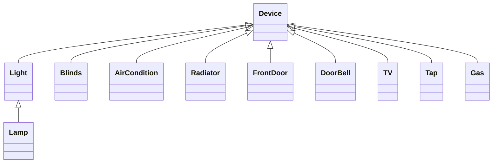

# Smart Home

Browser-based smart home dashboard. JS (OOP) + Bootstrap 5. Control devices by room, apply modes, manage global settings.

## Tech Stack

- HTML5, CSS3
- JavaScript (ES6 classes)
- Bootstrap 5.3 + Bootstrap Icons
- Open-Meteo API (weather)

## Project Structure

```
Smart Home/
├── index.html      # markup: rooms, global controls, modals
├── style.css       # styling
├── device.js       # Device classes (Light, TV, Blinds, Tap, Gas, ...)
├── room.js         # Room class + device instances
├── SmartHome.js    # SmartHome class + Mode class + mode instances
├── modal.js        # modal logic: room devices, apply/create/delete mode
├── script.js       # clock, connection status, weather, global controls
└── img/            # room photos
```

## Features

- Room modals — click a room card, see its devices, control each one (power, brightness, color, position, temperature, heat level, channel, volume, lock/unlock)
- Modes — built-in Away/Night, plus Create Mode (name it, pick devices) and Delete Mode
- Global controls — Lights, Climate, Security tabs
- Settings — modal with status of all devices, grouped by room
- Live weather (Lviv), clock, online/offline indicator

## Class Hierarchy


`Room` holds devices → `SmartHome` holds rooms + `Mode`s → `Mode.apply()` runs a list of stored actions.

## Run Locally

```bash
git clone https://github.com/anhika09/Smart-Home.git
cd "Smart-Home/Smart Home"
```

Open `index.html` with a local server (e.g. VS Code "Live Server" extension) — not by double-clicking the file. Requires internet connection (CDN assets + weather API).

## Limitations

- No persistence — refreshing resets all device states
- Front-end simulation only, no real hardware/backend

## Author

[anhika09](https://github.com/anhika09)
